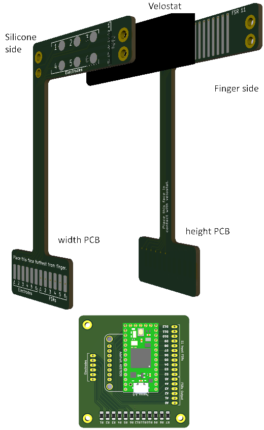

# FSR finger sensors

# Code

# PCBs

There are three PCBs for the finger FSRs:
  - The FPCB that has the electrodes in its height. It has the back side in contact with the finger, and the electrodes in contact with the velostat.
  - The FPCB that has the electrodes in its width, and the circular electrodes on the front. The rectangular electrodes are put in contact with the velostat, and the circular electrodes allow for connections to a hydrogel if desired
  - A main PCB that helps connect all these electrodes to a Teensy microcontroller. 

