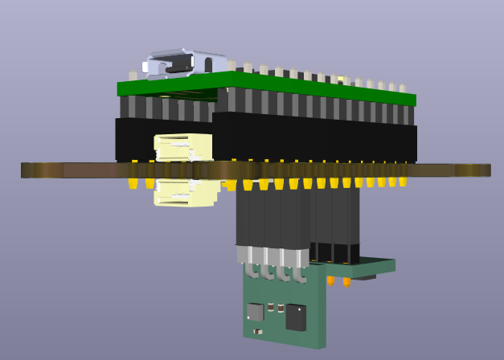

# CreateLabWork
In this repo you will find all the work done during the master thesis and during the master valorisation.

For the PCBs, you will find all the KiCAD files, as well as the gerber files to be able to order PCBs. The file 'PCB library' contains the footprint, the symbols and the 3D models of all the components used for all of the PCBs.

## GOAT
Contains the PCB for Max's robot. 

All the components were bought separately and soldered by hand. 

## Hands
Contains two folders, one with the hall sensors and the other with the FSRs.

For all the Hall sensor PCBs, all the components were bought separatly and soldered by hand. 
For the FSRs PCBs, there are no components to solder, one only needs to buy the PCBs. 

## IMU
The IMU folder contains various versions of the IMU. 

IMU_V2 is the round PCB that is used for the squid/tentacle projects. They are also the PCBs that need to be mounted on Max's PCB.

IMU_V3 is the sets of PCBs designed for the Helix type robot. There is the main PCBs that has the space for 2 perpendicular IMUs, the teensy and the I2C Qwiic connectors. There are also the files for the rectangular IMUs. 

Both types are accompanied by a pdf explaining everything needed to know for the IMUs. 

The IMUs are bought with the top side soldered on by JLCPCB. They have recently changed there classification of these sensors, so they must be bought in larger quantities and in panels because the PCBs are too small otherwise. The minimum quantity for the V3 was 45 IMUs. The back side of the PCBs must then be soldered by hand. 
For the main PCB, all the components were bought separatly and soldered by hand.

## MPXH6115AC6U_breakout
Contains the files for the PCBs that Kai asked for, it is a breakout for the MPXH6115AC6U pressure sensor.

## Tongue
Contains the files for Benhui's Tongue PCB. 

All the components were bought separatly and soldered by hand. 

